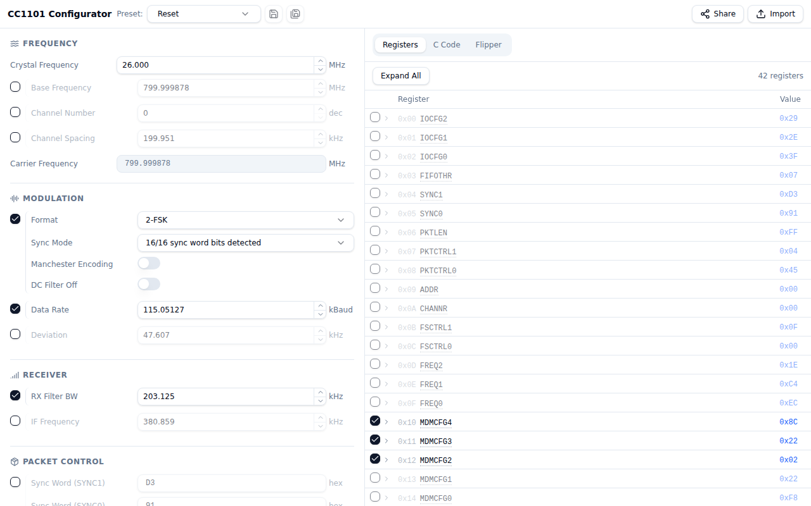

# CC1101 Configurator

An interactive web-based tool for configuring [Texas Instruments CC1101](https://www.ti.com/product/CC1101) sub-GHz RF transceiver registers. Tweak frequency, modulation, data rate, and packet settings, then export the configuration as C code, a register table, or a Flipper Zero SubGHz preset — or share it with a single URL.



## Features

- Configure all major CC1101 register groups: frequency, modulation, data rate, receiver, packet control, GPIO, and PA table
- Live output in multiple formats: C code, register table, and Flipper Zero SubGHz preset
- Save and load named presets (stored in browser localStorage)
- Share any configuration via a compact URL hash
- Import configurations from raw register dumps or Flipper Zero `.sub` files

## Running in dev mode

**Prerequisites:** Node.js 18+ and npm.

```bash
# Install dependencies
npm install

# Start the development server
npm run dev
```

The app will be available at `http://localhost:5173`.

## Building for production

```bash
npm run build
```

The output is placed in the `dist/` directory. The app is deployed to GitHub Pages via the included workflow.

## Running tests

```bash
npm test
```
